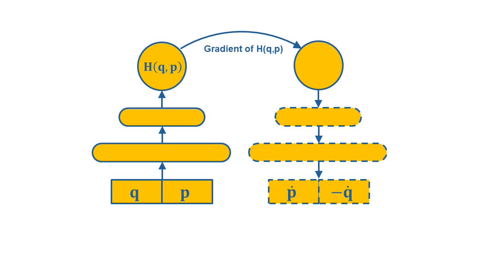

# Hamiltonian Neural Network

This MATLAB script demonstrates a simple implementation of a Hamiltonian
Neural Network (HNN) trained using the backpropagation algorithm.
Hamiltonian Neural Networks enable the use of Neural Networks under the
law of conservation of energy or other invariants. In this code, the task
of modeling the dynamics of the frictionless mass-spring system ("Task 1:
Ideal Mass-Spring" in Greydanus et al. (2019)) is solved. See this
reference for more details.

This script serves as a reference implementation to help users understand
how an HNN can be implemented and modify it for more advanced
applications.

No MATLAB toolbox is required to run this code, which is particularly
useful for educational HNN prototypes or if you want fine-grained control
over weight updates, learning rate, activation functions, etc. No
dependencies on MATLAB’s Deep Learning Toolbox or any other toolboxes
exist, therefore it can run on any MATLAB version. It is transparent and
easy to extend (ideal for HNN research and learning). The local functions
used in this script are listed alphabetically at the end of the main
script.

See the file readMe.pdf included in this package for a detailed
description.

Note: The results produced by the code may vary given the stochastic
nature of the algorithm or evaluation procedure, or differences in
numerical precision. For consistency purposes and without loss of
generality, the random number generator is appropriately initialized at
the be-ginning of the code. If this option is removed, consider running
the example a few times and compare the average outcome.

This code is licensed under CC BY 4.0 (https://creativecommons.org/licenses/by/4.0/). This license allows reusers to distribute, remix, adapt, and
build upon the material in any medium or format, even for commercial
purposes. It requires that reusers give credit to the creator.
